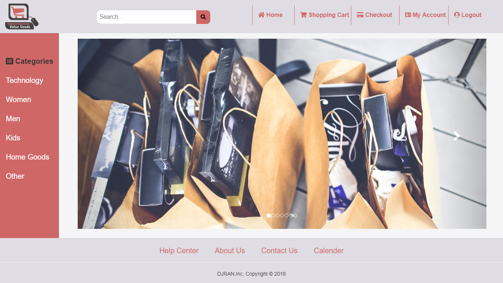
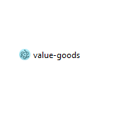

# Shopping network: My senior year project.


The above image is the front view of the software. It is as pretty as you think it is.

There are two ways that you can run this program.

1) To run it without using any command line or "magic" ways that most software engineer would know.

Download this entire repository and then open the folder Electronjs-SWE-Senior-Project. Once you are in the folder, please click the dist folder. Once you are in the dist folder, please click win-unpacked folder. Within that folder find the below file that have the same icon.



That should let you open the software and you can see at of the glory for your self.

2) You can run this software through the package.json and download all of the dependencies that would need to run this Electronjs file. First, you have to download node.js by going to <https://nodejs.org>. Then use your command line and follow the direction below.

```bash
# Clone this repository
git clone https://github.com/dacdao1/Electronjs-SWE-Senior-Project.git
# Go into the repository
cd Electronjs-SWE-Senior-Project
# Install dependencies
npm install
# Run the app
npm start
```

Thank you @Paul Beresuita <https://www.linkedin.com/in/paul-beresuita-15b91728> for the words of encouragement and vision to make me a better software engineer / problem solver.
